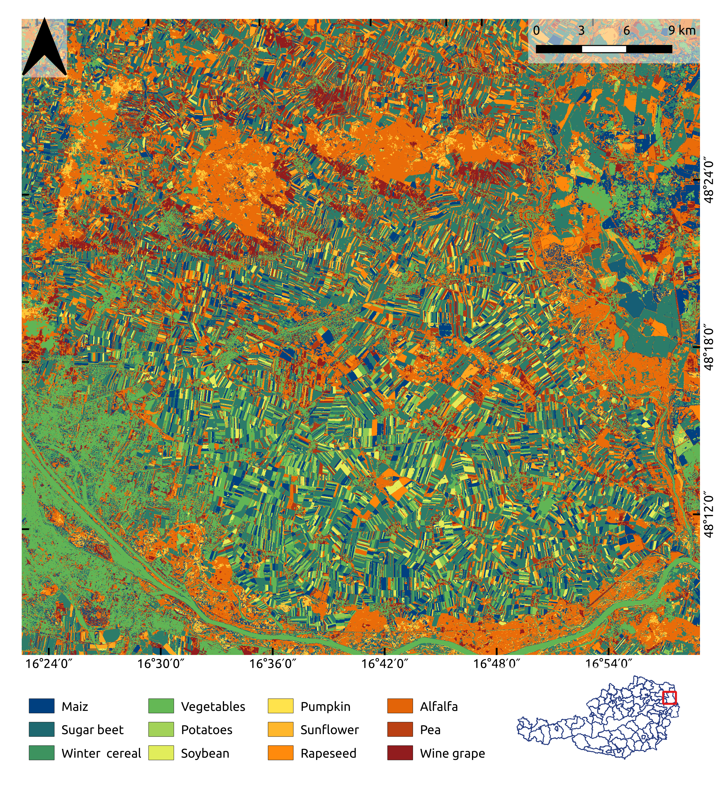

# boku_crop_classification
Classification of crop types in lower Austria. This project uses multi-temporal Sentinel-1 and Sentinel-2 satellite data to predict crop types. We employed various machine learning techniques in order to find the best model. More information about the materials, methodology and results can be found in the report.

Data
* Sentinel-1
* Sentinel-2

ML-techniques
* 
* Random forest
* SVM

study area

creating the final classification:

## Dependencies

## Run
